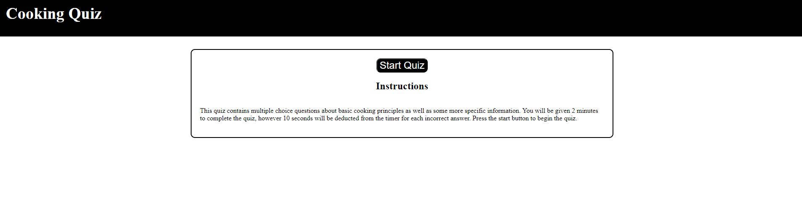

# Cooking-Quiz

## Description

This project was undertaken to build a quiz for users to test their knowledge on cooking terms and principles. It allows the user to complete the quiz within the alloted time and save their name and score on the leaderboard if they succeed.

The project uses HTML, CSS, and Javascript

## Installation

N/A

## Usage

The page can be accessed via this link: https://loganlagrange.github.io/cooking-quiz/

The page is used by reading the instructions and then clicking the start quiz button at which point the user will be presented with a series of questions, if answered incorrectly a message will display indicating so and 10 seconds will be deducted from their time left (impacting their score) when answered correctly it will move to the next question. If the time runs out the game ends and the user is given the option to play again. If they answer all questions successfully they are prompted to save their name and score to the leaderboard at which point they can again play again.

## Credits
N/A

## License
See LICENSE in repo.